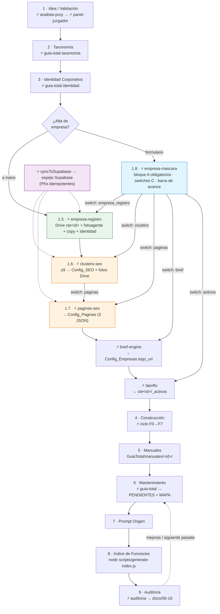
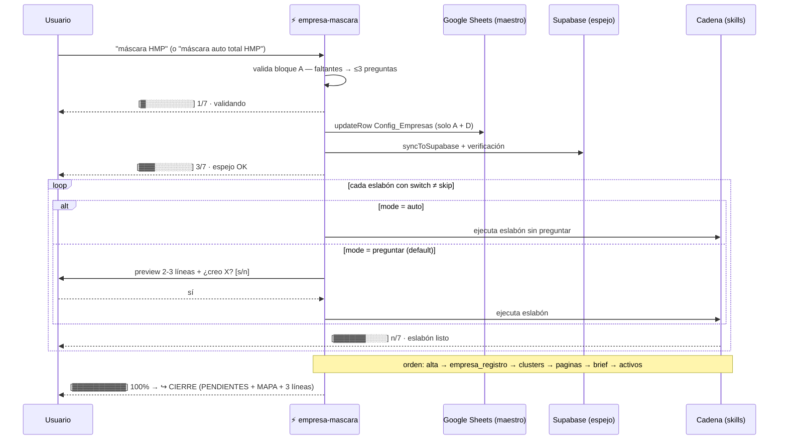
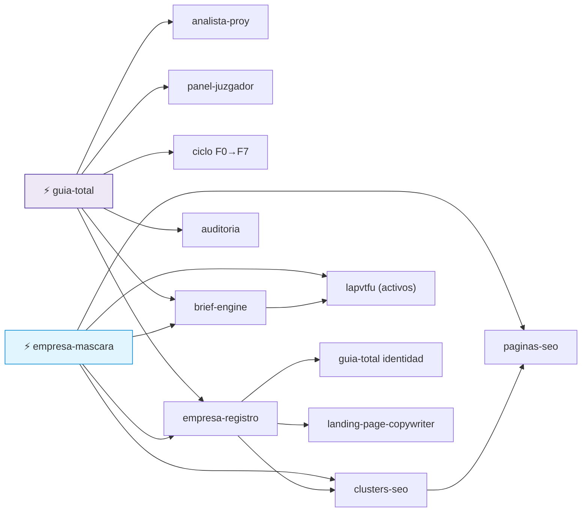

# MAPA_VISUAL.md — Versión gráfica de la Guía Total

> **Qué es:** vista derivada de [`MAPA.md`](MAPA.md) (el textual manda). 3 diagramas Mermaid:
> ciclo de vida completo · secuencia de la cadena con switches · grafo de dependencias.
> **Cuándo regenerar:** cuando cambia la estructura/flujo de un nodo de MAPA (misma regla de cierre).
> **Dónde se renderiza:** preview de VSCode y GitHub (extensiones Mermaid).

---

## 1. Ciclo de vida completo (con gates de aprobación)

**Leyenda:** rombo `{…}` = gate humano · punteado = disparo condicional/retroalimentación ·
`switch …` = solo ocurre si el eslabón está en `auto` o el usuario aprueba en `preguntar`.

---

## 2. Secuencia de la cadena — `empresa-mascara` con switches

---

## 3. Dependencias entre skills

---

*Regenerar con cualquier pasada de `guia-total` si el MAPA textual cambió de estructura
(ver cierre común en MAPA.md). Última sincronización: 2026-09-29 (§1.8 + §11 fichas).*
