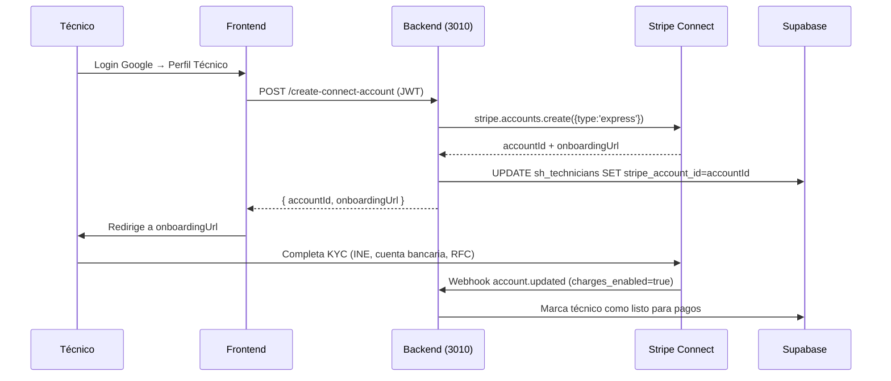
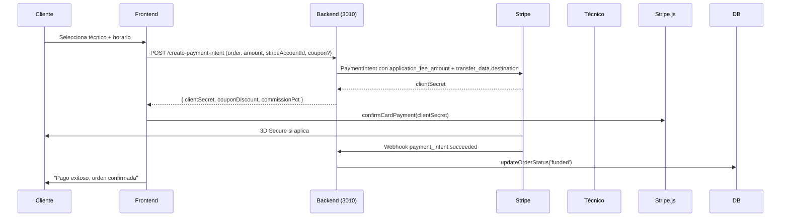

# MANUAL BACKEND — SuitServiHogar Reynosa

> **Versión:** 1.0  
> **Fecha:** 2026-09-15  
> **Stack:** Node.js 20 + Express + Supabase (PostgreSQL) + Stripe Connect  
> **Puerto:** 3010 (Express) + 3000 (Vite Frontend)

---

## 1. ARQUITECTURA GENERAL

```
┌─────────────────┐     ┌──────────────────┐     ┌─────────────────┐
│   Frontend      │────▶│  Express API     │────▶│   Supabase      │
│   (Vite 3000)   │     │  (Puerto 3010)   │     │   (PostgreSQL)  │
└─────────────────┘     └────────┬─────────┘     └─────────────────┘
                                 │
                    ┌────────────┴────────────┐
                    ▼                         ▼
              ┌─────────────┐           ┌─────────────┐
              │   Stripe    │           │  Stripe     │
              │  Connect    │           │  Webhooks   │
              │  (Cuentas)  │           │  (Eventos)  │
              └─────────────┘           └─────────────┘
```

### Servicios corriendo
| Servicio | Puerto | Comando |
|---|---|---|
| Frontend (Vite) | 3000 | `npm run dev` |
| Backend Express | 3010 | `node server.js` |
| Stripe Webhook (local) | — | `stripe listen --forward-to localhost:3010/api/webhook` |

---

## 2. VARIABLES DE ENTORNO (.env)

```bash
# Supabase
VITE_SUPABASE_URL=https://egyxgnlnzanxpqyuvmsg.supabase.co
VITE_SUPABASE_ANON_KEY=eyJhbGciOiJIUzI1NiIsInR5cCI6IkpXVCJ9...
SUPABASE_SERVICE_ROLE_KEY=eyJhbGciOiJIUzI1NiIsInR5cCI6IkpXVCJ9...

# Stripe (TEST MODE)
VITE_STRIPE_PUBLISHABLE_KEY=pk_test_51TnKxyDS4ye19Qf92EYCTMmRI8HpPuBkUvZgPnEqXN3wFVsXkvTrNLDiAattidTosXXrdtPkEOtFBRZf8ZhtIG8L00PUAz2psz
STRIPE_SECRET_KEY=sk_test_...
STRIPE_WEBHOOK_SECRET=whsec_...  # Configurar en Stripe Dashboard

# App
EXCHANGE_RATE_MXN_USD=18.0
PORT=3010
```

### Claves de prueba Stripe
- **Tarjeta:** `4242 4242 4242 4242`
- **Fecha:** Cualquier futura (ej. `12/28`)
- **CVC:** `123`
- **ZIP:** `88720`

---

## 3. ENDPOINTS API (server.js)

### Base URL: `http://localhost:3010/api`

| Método | Endpoint | Descripción | Auth |
|---|---|---|---|
| `POST` | `/create-connect-account` | Crea cuenta Stripe Connect para técnico | JWT |
| `POST` | `/create-payment-intent` | Crea PaymentIntent con split Connect | JWT |
| `POST` | `/api/validate-coupon` | Valida cupón de descuento | JWT |
| `POST` | `/webhook` | Recibe eventos Stripe (firma verificada) | Stripe Signature |

---

### 3.1 POST /api/create-connect-account

**Crea cuenta Stripe Connect Express para técnico**

```bash
curl -X POST http://localhost:3010/api/create-connect-account \
  -H "Authorization: Bearer <JWT_TOKEN>" \
  -H "Content-Type: application/json"
```

**Response:**
```json
{
  "accountId": "acct_123456789",
  "onboardingUrl": "https://connect.stripe.com/setup/.../..."
}
```

**Flujo:**
1. Frontend llama tras login técnico
2. Backend crea `stripe.accounts.create({ type: 'express' })`
3. Guarda `stripe_account_id` en `sh_technicians`
4. Retorna URL onboarding → técnico completa KYC en Stripe
5. Webhook `account.updated` marca `charges_enabled=true`

---

### 3.2 POST /api/create-payment-intent

**Crea PaymentIntent con split 15% platform / 85% técnico (o 10% si volume discount)**

```bash
curl -X POST http://localhost:3010/api/create-payment-intent \
  -H "Authorization: Bearer <JWT_TOKEN>" \
  -H "Content-Type: application/json" \
  -d '{
    "orderId": "ORD-001",
    "amountMxn": 85000,
    "stripeAccountId": "acct_123456789",
    "couponCode": "REF-TECH-ABC123"
  }'
```

**Body:**
```typescript
{
  orderId: string;           // ID orden en sh_orders
  amountMxn: number;         // Monto en CENTAVOS (ej. 85000 = $850 MXN)
  stripeAccountId: string;   // Cuenta Connect del técnico
  couponCode?: string;       // Opcional: código cupón
}
```

**Response:**
```json
{
  "clientSecret": "pi_123_secret_...",
  "couponDiscount": 150,     // Descuento aplicado en MXN
  "commissionPct": 15        // 15% normal, 10% si volume discount
}
```

**Lógica de comisión:**
```javascript
// Volume discount: 10% si técnico tiene 20+ órdenes completadas/mes Y rating > 4.7
const isVolumeDiscount = techOrdersCount >= 20 && techRating > 4.7;
const commissionPct = isVolumeDiscount ? 10 : 15;
const platformFee = Math.round(amountMxn * commissionPct / 100);
```

**Split Stripe:**
```javascript
const paymentIntent = await stripe.paymentIntents.create({
  amount: amountMxn - couponDiscount,
  currency: 'mxn',
  application_fee_amount: platformFee,      // 15% (o 10%) para plataforma
  transfer_data: {
    destination: stripeAccountId,           // 85% (o 90%) para técnico
  },
  metadata: { orderId, commissionPct },
});
```

---

### 3.3 POST /api/validate-coupon

```bash
curl -X POST http://localhost:3010/api/validate-coupon \
  -H "Authorization: Bearer <JWT_TOKEN>" \
  -H "Content-Type: application/json" \
  -d '{"code": "REF-TECH-ABC123", "amountMxn": 100000}'
```

**Response:**
```json
{
  "valid": true,
  "discountMxn": 150,      // $150 MXN descuento
  "message": "Cupón aplicado: $150 MXN de descuento"
}
```

**Reglas cupón:**
- Máx 50% del monto de la orden
- Mínimo $10 MXN pago final
- Incrementa `current_uses` al validar
- Expira según `expires_at` en `sh_coupons`

---

### 3.4 POST /webhook (Stripe)

**Recibe eventos firmados por Stripe**

```bash
# Configurar en Stripe Dashboard > Developers > Webhooks
# URL: https://tudominio.com/api/webhook
# Eventos: payment_intent.succeeded, payment_intent.payment_failed, account.updated
```

**Headers requeridos:**
```
Stripe-Signature: t=1234567890,v1=abc123...
```

**Eventos manejados:**

| Evento | Acción |
|---|---|
| `payment_intent.succeeded` | `updateOrderStatus(orderId, 'funded')` |
| `payment_intent.payment_failed` | `updateOrderStatus(orderId, 'failed')` + notifica cliente |
| `account.updated` | Si `charges_enabled=true` → técnico listo para cobrar |

**Verificación firma:**
```javascript
const sig = req.headers['stripe-signature'];
const event = stripe.webhooks.constructEvent(req.body, sig, STRIPE_WEBHOOK_SECRET);
```

---

## 4. BASE DE DATOS (Supabase)

### Esquema principal (`schema.sql` + migraciones)

| Tabla | Propósito | RLS |
|---|---|---|
| `sh_service_categories` | 13 categorías con precio base | Public read |
| `sh_technicians` | Técnicos verificados + `stripe_account_id` + `role` | Owner + Public read |
| `sh_orders` | Órdenes escrow + status machine | Owner (cliente/tech) |
| `sh_messages` | Chat restringido a fotos | Participantes |
| `sh_reviews` | Reseñas bidireccionales | Owner + Public read |
| `sh_referrals` | Referidos tech ($150) / client ($100 cupón) | Owner |
| `sh_coupons` | Cupones de descuento | Owner (insert) / Public (validate) |
| `sh_feedback` | Widget feedback usuarios | Owner (insert) |
| `sh_feedback` | Widget feedback usuarios | Owner (insert) |

### Status Machine (`sh_orders.status`)

```
draft → funded → in_progress → completed → released
  │         │           │            │          │
  │         │           │            │          └── PIN correcto → libera fondos (85% tech)
  │         │           │            └── Técnico "Marcar completado" + evidencia
  │         │           └── Técnico "Iniciar ruta"
  │         └── PaymentIntent succeeded (webhook)
  └── Orden creada (pre-pago)
```

### Cancelaciones
| Quién | Condición | Fee | Acción |
|---|---|---|---|
| Cliente | >24h | $0 | `status=cancelled`, refund total |
| Cliente | <24h | $120 MXN | `status=cancelled`, refund - $120 |
| Técnico | <2h antes | $150 MXN + -0.2★ + cupón $100 cliente | `status=cancelled` |
| Técnico | >2h antes | $0 | `status=cancelled` |

---

## 5. AUTENTICACIÓN Y AUTORIZACIÓN

### Flow Google OAuth (Supabase)
```javascript
// Frontend: authService.ts
const { data, error } = await supabase.auth.signInWithOAuth({
  provider: 'google',
  options: { redirectTo: 'https://egyxgnlnzanxpqyuvmsg.supabase.co/auth/v1/callback' }
});

// Callback: onAuthStateChange → getTechnicianByEmail(email)
// Busca en sh_technicians por email (ILIKE) → setCurrentTechnician
```

### JWT en Express (server.js)
```javascript
// Middleware requireAuth
const authHeader = req.headers.authorization;
const token = authHeader?.split(' ')[1];
const { data: { user }, error } = await supabase.auth.getUser(token);
if (error || !user) return res.status(401).json({ error: 'No autorizado' });
req.user = user; // Adjunta user a request
```

### RLS Policies (ejemplos)
```sql
-- sh_orders: cliente ve sus órdenes, técnico ve asignadas
CREATE POLICY "own_orders" ON sh_orders
  FOR SELECT USING (client_id = auth.uid() OR technician_id = (
    SELECT id FROM sh_technicians WHERE user_id = auth.uid()
  ));

-- sh_technicians: lectura pública, escritura solo owner/admin
CREATE POLICY "public_read" ON sh_technicians FOR SELECT USING (true);
CREATE POLICY "owner_write" ON sh_technicians FOR ALL USING (owner_id = auth.uid() OR is_admin());
```

### Función `is_admin_by_email()`
```sql
CREATE OR REPLACE FUNCTION is_admin_by_email(uemail TEXT)
RETURNS BOOLEAN AS $$
  SELECT EXISTS (
    SELECT 1 FROM sh_technicians t
    WHERE t.email = (auth.jwt() ->> 'email') AND t.role = 'admin'
  );
$$ LANGUAGE sql SECURITY DEFINER STABLE;
```

---

## 6. STRIPE CONNECT - FLUJO COMPLETO

### Onboarding Técnico


### Pagos con Split


---

## 7. COMANDOS ÚTILES

### Desarrollo
```bash
# Inicia todo (3 terminales)
npm run dev                    # Terminal 1: Frontend 3000
node server.js                 # Terminal 2: Backend 3010
stripe listen --forward-to localhost:3010/api/webhook  # Terminal 3: Webhooks

# Solo backend
node server.js

# Verificar sintaxis
node --check server.js
npx tsc --noEmit
```

### Stripe CLI
```bash
# Login
stripe login

# Webhooks local
stripe listen --forward-to localhost:3010/api/webhook

# Ver eventos
stripe events list

# Crear producto/precio test
stripe products create --name="Test" --default-price-data[currency]=mxn --default-price-data[unit_amount]=85000
```

### Supabase
```bash
# Migraciones (requiere PAT)
supabase db push --project-ref egyxgnlnzanxpqyuvmsg

# Ver logs
supabase logs --project-ref egyxgnlnzanxpqyuvmsg

# Generar types
supabase gen types typescript --project-ref egyxgnlnzanxpqyuvmsg > src/types/supabase.ts
```

### Base de datos directa
```sql
-- Ver órdenes recientes
SELECT id, status, total_mxn/100 as total_mxn, created_at
FROM sh_orders ORDER BY created_at DESC LIMIT 10;

-- Ver técnicos con Stripe conectado
SELECT name, email, stripe_account_id, active
FROM sh_technicians WHERE stripe_account_id IS NOT NULL;

-- Ver comisiones por orden
SELECT o.id, o.total_mxn/100 as total, pi.metadata->>'commissionPct' as commission
FROM sh_orders o
JOIN stripe_payment_intents pi ON pi.metadata->>'orderId' = o.id;
```

---

## 8. DESPLIEGUE

### Frontend → GitHub Pages
```bash
npm run build          # Genera dist/
git add dist && git commit -m "deploy" && git push origin main
# GitHub Action deploya a GitHub Pages automáticamente
```

### Backend (Opciones)
| Opción | Descripción |
|---|---|
| **Railway/Render/Fly.io** | `node server.js` + env vars |
| **VPS (Ubuntu)** | PM2 + Nginx reverse proxy + SSL |
| **Supabase Edge Functions** | Migrar endpoints a Deno (futuro) |

### Variables producción
```bash
NODE_ENV=production
PORT=3010
STRIPE_WEBHOOK_SECRET=whsec_prod_...
# URLs producción en Stripe Dashboard > Webhooks
```

### Health Check
```bash
curl http://localhost:3010/health  # Debería responder 200 OK
```

---

## 9. MONITOREO Y DEBUG

### Logs Express
```bash
# Desarrollo
node server.js 2>&1 | tee server.log

# Producción (PM2)
pm2 logs server
pm2 monit
```

### Debug Stripe
```bash
# Ver PaymentIntents recientes
stripe payment_intents list --limit 10

# Ver cuenta Connect
stripe accounts get acct_123456789

# Simular webhook local
stripe trigger payment_intent.succeeded
```

### Debug Supabase
```sql
-- Ver RLS policies
SELECT * FROM pg_policies WHERE schemaname = 'public';

-- Ver últimos webhooks procesados
SELECT * FROM sh_orders WHERE status = 'funded' ORDER BY created_at DESC LIMIT 5;

-- Ver técnicos con pagos pendientes
SELECT t.name, t.stripe_account_id, COUNT(o.id) as ordenes_pendientes
FROM sh_technicians t
LEFT JOIN sh_orders o ON o.technician_id = t.id AND o.status IN ('funded','in_progress','completed')
GROUP BY t.id;
```

### Debug Frontend
```bash
# Abrir DevTools > Network > filtrar /api/
# Ver requests: create-payment-intent, validate-coupon, webhook
# Ver localStorage: fx_rate, fx_ts (cache tipo de cambio)
```

---

## 10. CHECKLIST PRE-PRODUCCIÓN

| Item | Comando/Verificación | ✅ |
|---|---|---|
| TypeScript limpio | `npx tsc --noEmit` | |
| Unit tests | `npm test` | |
| E2E smoke | `npm run test:e2e` | |
| Sintaxis server.js | `node --check server.js` | |
| Stripe webhook configurado | Dashboard > Webhooks > URL + eventos | |
| `STRIPE_WEBHOOK_SECRET` en .env | Copiado de Stripe Dashboard | |
| Google OAuth habilitado | Supabase Dashboard > Auth > Providers | |
| RLS policies aplicadas | `supabase db push` | |
| Migraciones aplicadas | `supabase migration list` | |
| Variables .env producción | Todas presentes | |
| Health check responde | `curl /health` | |

---

## 11. ARCHIVOS CLAVE

| Archivo | Descripción |
|---|---|
| `server.js` | Express API + Stripe Connect + Webhooks |
| `src/services/bookingService.ts` | Lógica órdenes (create, status, cancel) |
| `src/services/authService.ts` | Google OAuth + técnico lookup |
| `src/services/referralService.ts` | Referidos + cupones |
| `src/services/exchangeRate.ts` | Tipo de cambio Fixer.io + cache |
| `src/hooks/useStripePayment.ts` | Frontend Stripe integration |
| `src/lib/constants.ts` | `EXCHANGE_RATE_MXN_USD`, colonias |
| `schema.sql` | Esquema completo + seed |
| `migrations/002-009_*.sql` | Migraciones incrementales |
| `.github/workflows/ci.yml` | CI/CD pipeline |

---

## 12. CONTACTO Y ESCALACIÓN

| Problema | Contacto |
|---|---|
| Stripe Connect / Pagos | Revisar logs `server.js` + Stripe Dashboard |
| Supabase / RLS | `supabase logs` + SQL directo |
| Google OAuth | Supabase Dashboard > Auth > Logs |
| Deploy Frontend | GitHub Actions > Pages deploy |
| Deploy Backend | PM2 logs / Railway/Render logs |

---

**Fin del Manual Backend v1.0**