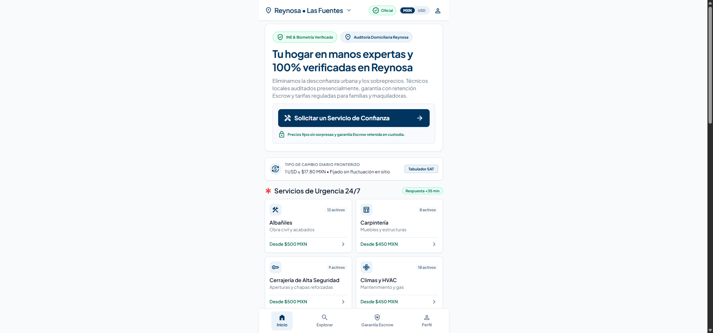
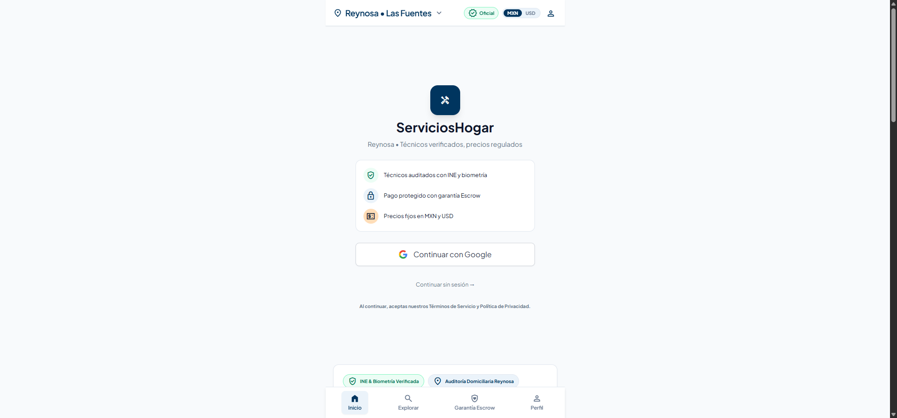
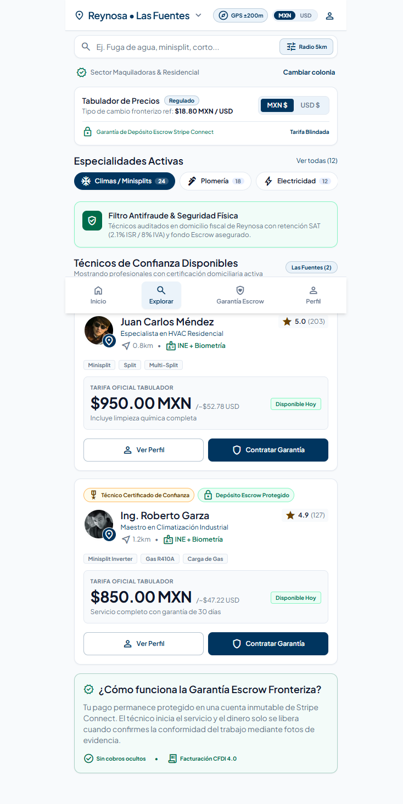
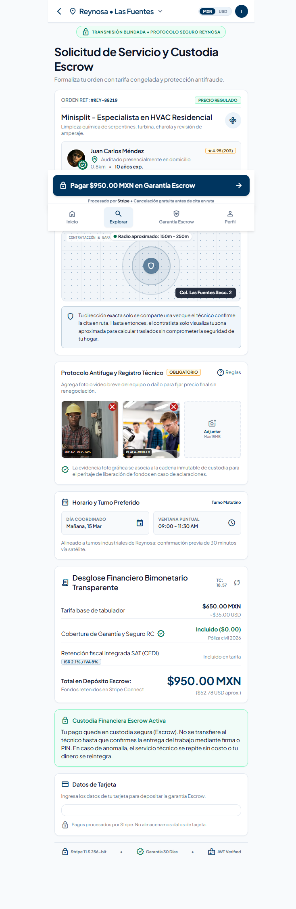
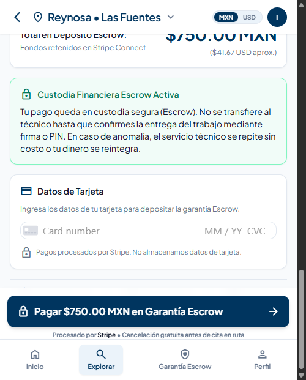
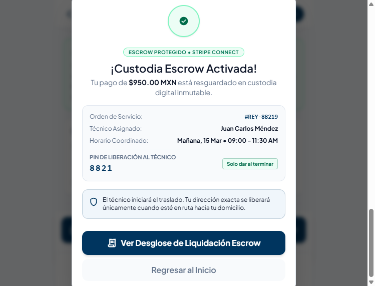
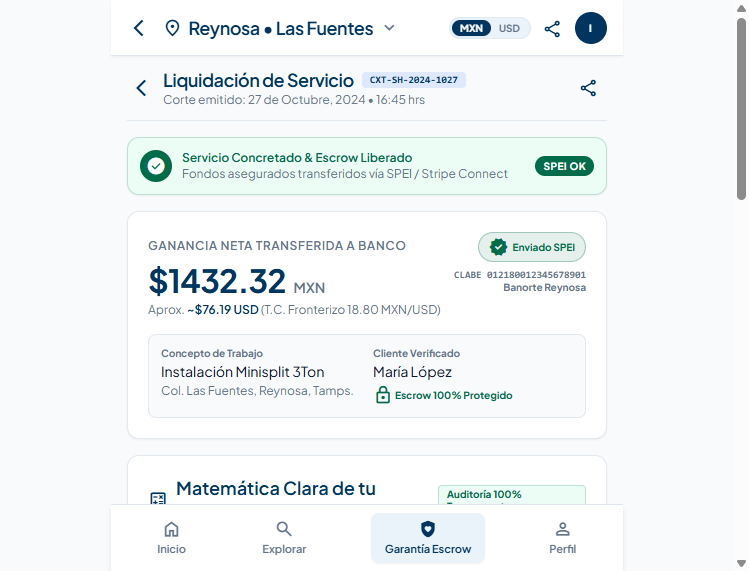

# Manual Operativo — Cliente (Quien Solicita el Servicio)

**Versión:** 1.0 | **Última actualización:** 2026-09-15
**Plataforma:** ServiciosHogar — Reynosa, Tamaulipas

---

## Tabla de Contenidos
1. [Bienvenida](#1-bienvenida)
2. [Pantalla de Inicio](#2-pantalla-de-inicio)
3. [Iniciar Sesión](#3-iniciar-sesión)
4. [Explorar Técnicos](#4-explorar-técnicos)
5. [Seleccionar un Técnico](#5-seleccionar-un-técnico)
6. [Reservar y Pagar](#6-reservar-y-pagar)
7. [Confirmación y PIN](#7-confirmación-y-pin)
8. [Liquidación y Comprobante](#8-liquidación-y-comprobante)
9. [Diagrama de Flujo](#9-diagrama-de-flujo)

---

## 1. Bienvenida

ServiciosHogar conecta familias en Reynosa con técnicos auditados y verificados. Cada servicio incluye:

- **Técnicos con INE y biometría verificada** — auditados presencialmente
- **Pago protegido con garantía Escrow** — tu dinero se retiene hasta confirmar el trabajo
- **Precios fijos en MXN y USD** — sin sorpresas ni sobrecostos
- **Cancelación gratuita** — hasta 24 horas antes del servicio

---

## 2. Pantalla de Inicio



Al abrir la app, verás:

| Elemento | Descripción |
|----------|-------------|
| **Barra superior** | Tu colonia actual (ej. "Reynosa • Las Fuentes"), selector MXN/USD |
| **Hero** | "Tu hogar en manos expertas y 100% verificadas en Reynosa" |
| **Botón principal** | "Solicitar un Servicio de Confianza" — inicia el flujo |
| **Tipo de cambio** | Referencia diaria fronteriza (ej. 1 USD ≈ $17.80 MXN) |
| **Categorías** | 13 especialidades con precio base (Albañiles, Carpintería, Cerrajería, Climas, etc.) |
| **Navegación inferior** | Inicio · Explorar · Garantía Escrow · Perfil |

**Acción:** Toca **"Solicitar un Servicio de Confianza"** o selecciona una categoría.

---

## 3. Iniciar Sesión



La app te pedirá iniciar sesión para continuar. Opciones:

| Opción | Descripción |
|--------|-------------|
| **Continuar con Google** | Usa tu cuenta de Google (recomendado para acceso rápido) |
| **Continuar sin sesión** | Explora la app sin compromiso, pero necesitarás login para reservar |

> **Tip:** "Continuar sin sesión" te permite ver técnicos y precios antes de decidirte.

---

## 4. Explorar Técnicos



La pantalla Explorar muestra:

| Sección | Qué hace |
|---------|----------|
| **Barra de búsqueda** | Busca por tipo de servicio (ej. "Fuga de agua", "minisplit") |
| **Filtro GPS** | Radio de búsqueda (ej. ±200m, 5km) |
| **Selector de colonia** | Cambia tu zona para ver técnicos cercanos |
| **Filtros de categoría** | Chips: Climas 24 · Plomería 18 · Electricidad 12 |
| **Tarifa regulada** | Tipo de cambio fronterizo y garantía Escrow visible |
| **Técnicos disponibles** | Lista con nombre, especialidad, distancia, rating, precio |

**Cada tarjeta de técnico muestra:**
- Foto, nombre y rating (ej. ★ 5.0 con 203 reseñas)
- Especialidad y verificación (INE + Biometría)
- Distancia (ej. 0.8km)
- Tags de servicios (Minisplit, Split, Multi-Split)
- **Precio oficial regulado** en MXN y USD
- Botón "Ver Perfil" y "Contratar Garantía"

---

## 5. Seleccionar un Técnico

Al tocar **"Contratar Garantía"**, verás el resumen del técnico:

- Nombre completo y rating
- Distancia desde tu colonia
- Años de experiencia
- Distintivo de confianza (si aplica)
- Precio total del servicio

**Acción:** Toca **"Contratar Garantía"** para continuar al booking.

---

## 6. Reservar y Pagar

### 6.1 Formulario de Reserva



La pantalla de reserva contiene:

| Sección | Contenido |
|---------|-----------|
| **Orden Ref.** | Número único (ej. #REY-88219) con etiqueta "PRECIO REGULADO" |
| **Servicio** | Nombre del servicio y técnico asignado |
| **Mapa de zona** | Radio aproximado de tu ubicación (150m–250m). Tu dirección exacta NO se comparte hasta que el técnico confirme la cita |
| **Protocolo Antifuga** | Fotos/videos del equipo o daño (obligatorio). Se adjuntan evidencias fotográficas |
| **Horario preferido** | Día coordinado y ventana de tiempo (ej. Mañana 09:00 – 11:30 AM) |
| **Desglose financiero** | Desglose completo en MXN y USD |
| **Datos de tarjeta** | Campo para ingresar tarjeta bancaria (procesado por Stripe) |

### 6.2 Desglose del Pago

El desglose muestra transparencia total:

```
Tarifa base de tabulador:           $650.00 MXN  (~$35.00 USD)
Cobertura de Garantía y Seguro RC:  Incluido ($0.00)
Retención fiscal integrada SAT:     ISR 2.1% / IVA 8%
                                    ──────────────────────
Total en Depósito Escrow:           $950.00 MXN  (~$52.78 USD)
```

> **Nota:** El monto total incluye impuestos SAT (ISR 2.1% + IVA 8%) y seguro de responsabilidad civil.

### 6.3 Ingresar Datos de Tarjeta



Ingresa los datos de tu tarjeta:
- Número de tarjeta
- Fecha de vencimiento (MM/YY)
- Código de seguridad (CVC)

> **Seguridad:** Los pagos son procesados por Stripe. ServiciosHogar NO almacena datos de tarjeta.

**Acción:** Toca **"Pagar $[monto] MXN en Garantía Escrow"** para confirmar el pago.

---

## 7. Confirmación y PIN



Tras el pago exitoso, verás:

| Campo | Descripción |
|-------|-------------|
| **Estado** | "¡Custodia Escrow Activada!" — tu pago está protegido |
| **Orden de Servicio** | Número de referencia (ej. #REY-88219) |
| **Técnico Asignado** | Nombre del técnico que realizará el trabajo |
| **Horario Coordinado** | Día y ventana de tiempo acordada |
| **PIN de Liberación** | Código de 4 dígitos (ej. **8821**) — **guárdalo, lo necesitarás al finalizar** |

> **IMPORTANTE:** El PIN se entrega solo al terminar el servicio. No lo compartas antes de confirmar que el trabajo está bien hecho.

**Opciones:**
- **"Ver Desglose de Liquidación Escrow"** — ver el desglose financiero completo
- **"Regresar al Inicio"** — volver a la pantalla principal

---

## 8. Liquidación y Comprobante



Después de que el técnico completa el servicio y tú entregas el PIN, recibirás el comprobante de liquidación:

| Campo | Descripción |
|-------|-------------|
| **Estado** | "Servicio Concretado & Escrow Liberado" |
| **Ganancia neta transferida** | Monto que recibe el técnico (ej. $1,432.32 MXN) |
| **Concepto de trabajo** | Descripción del servicio realizado |
| **Cliente verificado** | Tu nombre confirmado |
| **CLABE interbancaria** | Cuenta destino del técnico |
| **Comprobante SPEI** | Referencia de transferencia bancaria |

---

## 9. Diagrama de Flujo

```
┌─────────────────────────────────────────────────────────┐
│                    FLUJO DEL CLIENTE                     │
└─────────────────────────────────────────────────────────┘

  ┌──────────────┐
  │   INICIO     │
  │  (App web)   │
  └──────┬───────┘
         │
         ▼
  ┌──────────────┐     ┌──────────────┐
  │  Seleccionar │     │  ¿Tiene      │
  │  categoría o │────▶│  sesión?     │
  │  "Solicitar" │     └──────┬───────┘
  └──────────────┘            │
                    No ───────┤──── Sí
                    │         │         │
                    ▼         │         │
           ┌────────────┐    │         │
           │   Login    │    │         │
           │  (Google)  │    │         │
           └─────┬──────┘    │         │
                 │           │         │
                 └─────┬─────┘         │
                       │               │
                       ▼               │
              ┌────────────────┐       │
              │   EXPLORAR     │◀──────┘
              │  Técnicos      │
              │  (categoría,   │
              │   colonia,     │
              │   precio)      │
              └───────┬────────┘
                      │
                      ▼
              ┌────────────────┐
              │  Seleccionar   │
              │  técnico       │
              │  (ver perfil,  │
              │   rating,      │
              │   distancia)   │
              └───────┬────────┘
                      │
                      ▼
              ┌────────────────┐
              │   BOOKING      │
              │  Escrow        │
              │  • Elegir día  │
              │  • Adjuntar    │
              │    fotos       │
              │  • Ver precio  │
              └───────┬────────┘
                      │
                      ▼
              ┌────────────────┐
              │  Ingresar      │
              │  datos de      │
              │  tarjeta       │
              │  (Stripe)      │
              └───────┬────────┘
                      │
                      ▼
              ┌────────────────┐
              │  PAGAR         │
              │  "Pagar $XXX   │
              │  MXN en        │
              │  Garantía      │
              │  Escrow"       │
              └───────┬────────┘
                      │
                      ▼
              ┌────────────────┐
              │  CONFIRMACIÓN  │
              │  "¡Escrow      │
              │  Activada!"    │
              │                │
              │  ┌──────────┐  │
              │  │ PIN:XXXX │  │  ← Guardar este PIN
              │  └──────────┘  │
              └───────┬────────┘
                      │
                      ▼
              ┌────────────────┐
              │  Esperar       │
              │  servicio      │
              │  (técnico en   │
              │   camino)      │
              └───────┬────────┘
                      │
                      ▼
              ┌────────────────┐
              │  Servicio      │
              │  completado    │
              │  ✓             │
              └───────┬────────┘
                      │
                      ▼
              ┌────────────────┐
              │  Compartir     │
              │  PIN con       │
              │  técnico       │
              │  (4 dígitos)   │
              └───────┬────────┘
                      │
                      ▼
              ┌────────────────┐
              │  COMPROBANTE   │
              │  Liquidación   │
              │  Escrow        │
              │  liberado ✓    │
              └────────────────┘
```

---

## Preguntas Frecuentes

**¿Puedo cancelar sin costo?**
Sí, hasta 24 horas antes del servicio. Menos de 24 horas tiene un cargo de $120 MXN.

**¿Cómo sé que el técnico es confiable?**
Todos los técnicos tienen INE verificada, biometría, y son auditados presencialmente. El rating (★) refleja reseñas de otros clientes.

**¿Qué pasa si el trabajo no me gusta?**
Tu pago está en custodia Escrow. Si no estás satisfecho, el servicio se repite sin costo o recibes un reembolso.

**¿Puedo pagar en efectivo?**
No. Todos los pagos se procesan por Stripe con tarjeta bancaria para garantizar la protección Escrow.

---

> **Nota para desarrolladores:** Si se modifica la interfaz de usuario, actualizar este manual y las capturas en `evidence/`.
