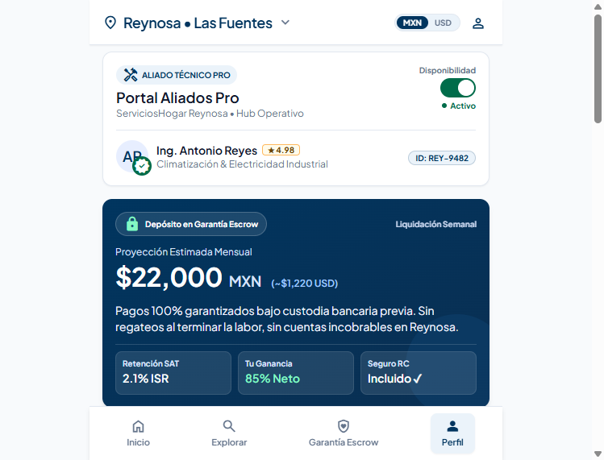
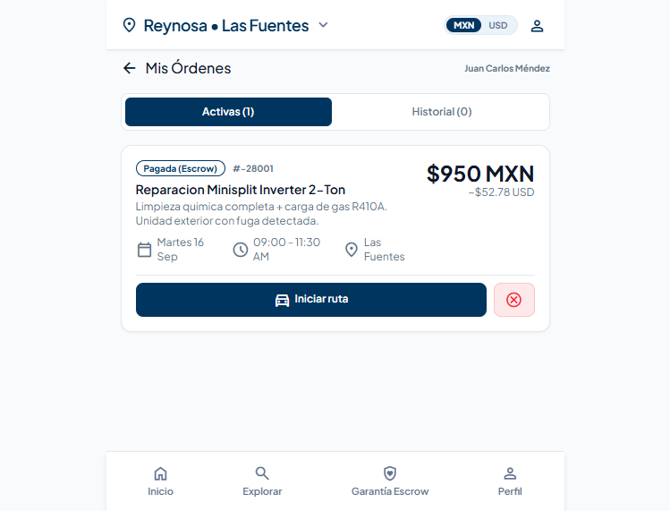
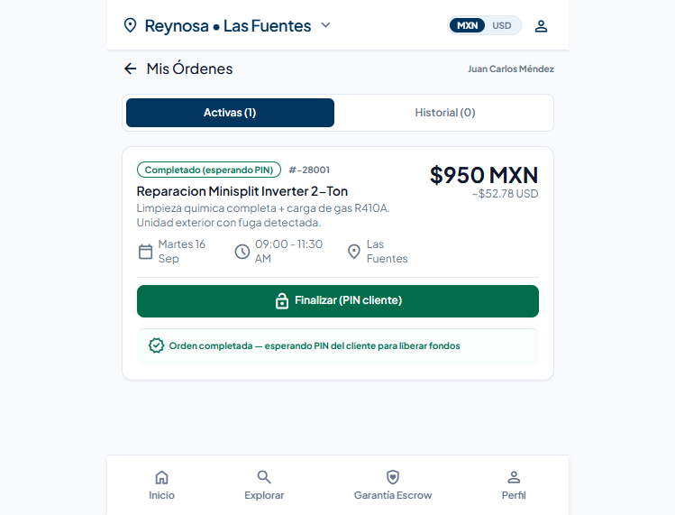
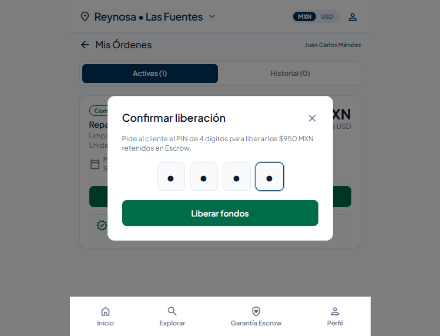
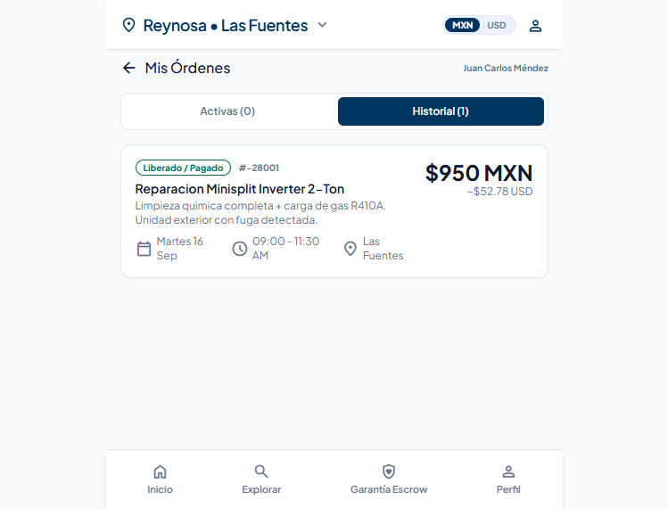

# Manual Operativo — Técnico (Quien Presta el Servicio)

**Versión:** 1.0 | **Última actualización:** 2026-09-15
**Plataforma:** ServiciosHogar — Aliado Técnico Pro

---

## Tabla de Contenidos
1. [Bienvenida](#1-bienvenida)
2. [Portal Aliados Pro](#2-portal-aliados-pro)
3. [Acceder a Mis Órdenes](#3-acceder-a-mis-órdenes)
4. [Gestionar Órdenes Activas](#4-gestionar-órdenes-activas)
5. [Iniciar Ruta](#5-iniciar-ruta)
6. [Subir Evidencia Fotográfica](#6-subir-evidencia-fotográfica)
7. [Completar y Liberar Fondos (PIN)](#7-completar-y-liberar-fondos-pin)
8. [Historial de Órdenes](#8-historial-de-órdenes)
9. [Diagrama de Flujo](#9-diagrama-de-flujo)

---

## 1. Bienvenida

Como técnico aliado de ServiciosHogar, tu trabajo está protegido por el sistema Escrow:

- **Pago garantizado** — el cliente deposita antes del servicio; tú recibes al 85% al completar
- **Sin cobros ocultos** — tarifas reguladas, sin regateo
- **Facturación CFDI 4.0** — SAT integrado (ISR 2.1% + IVA 8% retenido)
- **Seguro de Responsabilidad Civil** — incluido sin costo adicional
- **Liquidación vía SPEI** — transferencia directa a tu cuenta bancaria

---

## 2. Portal Aliados Pro



Al iniciar sesión con tu cuenta de técnico, accedes al **Portal Aliados Pro**:

| Elemento | Descripción |
|----------|-------------|
| **Header** | "Portal Aliados Pro" — Hub Operativo |
| **Disponibilidad** | Toggle para activar/desactivar recepción de órdenes |
| **Tu perfil** | Nombre, rating (ej. ★ 4.98), especialidad, ID único |
| **Proyección mensual** | Estimado de ingresos (ej. $22,000 MXN / ~$1,220 USD) |
| **Desglose** | Retención SAT (2.1% ISR) · Tu ganancia (85% Neto) · Seguro RC (Incluido) |
| **Navegación** | Inicio · Explorar · Garantía Escrow · **Perfil** (estás aquí) |

**Acción:** Toca **"Ver Mis Órdenes"** para ver tus servicios asignados.

---

## 3. Acceder a Mis Órdenes

Desde el Portal Aliados Pro, toca el botón **"Ver Mis Órdenes"** para acceder a la gestión de servicios.

La pantalla **Mis Órdenes** muestra:

| Pestaña | Contenido |
|---------|-----------|
| **Activas** | Órdenes en estado: pagada (Escrow), en progreso, o completada |
| **Historial** | Órdenes liberadas/pagadas anteriormente |

---

## 4. Gestionar Órdenes Activas



Cada orden activa muestra:

| Campo | Ejemplo |
|-------|---------|
| **Estado** | "Pagada (Escrow)" — el cliente ya pagó, fondos retenidos |
| **Número** | # -28001 |
| **Servicio** | Reparación Minisplit Inverter 2-Ton |
| **Descripción** | Limpieza química completa + carga de gas R410A |
| **Precio** | $950 MXN (~$52.78 USD) |
| **Fecha** | Martes 16 Sep |
| **Horario** | 09:00 – 11:30 AM |
| **Zona** | Las Fuentes |

### Acciones por Estado

| Estado | Acción disponible |
|--------|-------------------|
| **Pagada (Escrow)** | "Iniciar ruta" |
| **En progreso** | "Marcar completado" |
| **Completada** | "Finalizar (PIN cliente)" |

---

## 5. Iniciar Ruta

Cuando estés listo para dirigirte al domicilio del cliente:

1. Toca **"Iniciar ruta"**
2. El estado cambia de "Pagada (Escrow)" → **"En progreso"**
3. La dirección exacta del cliente se libera (antes solo veías la zona aproximada)

> **Nota:** La dirección exacta solo se comparte una vez que confirmas la cita en ruta.

---

## 6. Subir Evidencia Fotográfica

Durante o después del servicio, sube fotos como evidencia:

1. Toca **"Subir Evidencia"** (disponible en estado "En progreso")
2. Se abre la cámara o selector de archivos
3. Toma/selecciona una foto del trabajo realizado
4. La foto se sube al bucket `sh-evidence` de Supabase
5. La evidencia se asocia a la cadena de custodia de la orden

> **Importante:** La evidencia fotográfica es tu protección en caso de disputas.

---

## 7. Completar y Liberar Fondos (PIN)

### 7.1 Marcar Completado



Una vez terminado el trabajo:

1. Toca **"Marcar completado"**
2. El estado cambia a **"Completado (esperando PIN)"**
3. Aparece el botón **"Finalizar (PIN cliente)"**

### 7.2 Ingresar PIN del Cliente



1. Pide al cliente su **PIN de 4 dígitos** (lo recibió al confirmar el pago)
2. Toca **"Finalizar (PIN cliente)"**
3. Se abre el modal **"Confirmar liberación"**
4. Ingresa los 4 dígitos del PIN
5. Toca **"Liberar fondos"**

> **Nota:** El PIN confirma que el cliente aceptó el trabajo. Sin PIN, los fondos no se liberan.

### 7.3 Fondos Liberados



Tras ingresar el PIN correcto:

1. El estado cambia a **"Liberado / Pagado"**
2. La orden se mueve a la pestaña **Historial**
3. Los fondos se transfieren vía SPEI a tu cuenta bancaria (85% del monto total)
4. Recibes comprobante de liquidación con CLABE y referencia SPEI

---

## 8. Historial de Órdenes

En la pestaña **Historial** verás todas las órdenes completadas y pagadas:

| Campo | Descripción |
|-------|-------------|
| **Estado** | "Liberado / Pagado" |
| **Número** | # -28001 |
| **Servicio** | Descripción del trabajo |
| **Monto** | Total pagado por el cliente |
| **Fecha y hora** | Cuándo se realizó |

---

## 9. Diagrama de Flujo

```
┌─────────────────────────────────────────────────────────┐
│                   FLUJO DEL TÉCNICO                      │
└─────────────────────────────────────────────────────────┘

  ┌──────────────┐
  │   INICIO     │
  │  (Login)     │
  └──────┬───────┘
         │
         ▼
  ┌──────────────┐
  │  Portal      │
  │  Aliados Pro │
  │  (Perfil)    │
  └──────┬───────┘
         │
         ▼
  ┌──────────────┐
  │  "Ver Mis    │
  │  Órdenes"    │
  └──────┬───────┘
         │
         ▼
  ┌──────────────────────────────────┐
  │        PESTAÑA ACTIVAS           │
  │  ┌────────────────────────────┐  │
  │  │ Estado: Pagada (Escrow)    │  │
  │  │ Servicio: Reparación...    │  │
  │  │ Precio: $950 MXN           │  │
  │  │ Fecha: Martes 16, 09-11:30 │  │
  │  └────────────────────────────┘  │
  └──────────────┬───────────────────┘
                 │
                 ▼
        ┌────────────────┐
        │  "Iniciar      │
        │   ruta"        │──────▶  Estado cambia a
        └───────┬────────┘        "En progreso"
                │                        │
                ▼                        ▼
        ┌────────────────┐     ┌────────────────┐
        │  Dirigirse al  │     │  Dirección     │
        │  domicilio     │     │  exacta        │
        │  del cliente   │     │  liberada      │
        └───────┬────────┘     └────────────────┘
                │
                ▼
        ┌────────────────┐
        │  Realizar      │
        │  el servicio   │
        │  (trabajo)     │
        └───────┬────────┘
                │
                ▼
        ┌────────────────┐
        │  Subir eviden- │
        │  cia fotográ-  │
        │  fica (opcional│
        │  pero recomen- │
        │  dada)         │
        └───────┬────────┘
                │
                ▼
        ┌────────────────┐
        │  "Marcar       │
        │   completado"  │──────▶  Estado cambia a
        └───────┬────────┘        "Completado
                │                 (esperando PIN)"
                ▼
        ┌────────────────┐
        │  Pedir al      │
        │  cliente su    │
        │  PIN de 4      │
        │  dígitos       │
        └───────┬────────┘
                │
                ▼
        ┌────────────────┐
        │  "Finalizar    │
        │  (PIN cliente)"│
        └───────┬────────┘
                │
                ▼
        ┌────────────────┐
        │  Modal:        │
        │  "Confirmar    │
        │   liberación"  │
        │                │
        │  [■][■][■][■]  │  ← Ingresa PIN
        │                │
        │  "Liberar      │
        │   fondos"      │
        └───────┬────────┘
                │
                ▼
  ┌──────────────────────────────────┐
  │      FONDOS LIBERADOS            │
  │  • Estado: "Liberado / Pagado"   │
  │  • Orden se mueve a HISTORIAL    │
  │  • 85% se transfiere vía SPEI    │
  │  • Comprobante con CLABE y ref.  │
  └──────────────────────────────────┘
```

---

## Resumen de Estados

```
Pagada (Escrow)  ──▶  En progreso  ──▶  Completado  ──▶  Liberado / Pagado
     │                    │                  │                    │
     │ "Iniciar ruta"     │ "Marcar          │ "Finalizar         │ Fondos
     │                    │  completado"     │  (PIN)"            │ transferidos
     ▼                    ▼                  ▼                    ▼
  [funded]           [in_progress]       [completed]           [released]
```

---

## Preguntas Frecuentes

**¿Qué pasa si el cliente no me da el PIN?**
Los fondos permanecen en custodia. Contacta soporte para resolver la situación.

**¿Puedo cancelar un servicio?**
Sí, más de 2 horas antes sin penalización. Menos de 2 horas: $150 MXN de penalización y -0.2★ en tu rating.

**¿Cómo recibo mi pago?**
Vía SPEI a tu cuenta bancaria registrada. El monto es el 85% del total, con retenciones SAT ya aplicadas.

**¿Necesito facturar?**
La facturación CFDI 4.0 está integrada. El sistema genera el comprobante automáticamente.

---

> **Nota para desarrolladores:** Si se modifica la interfaz de usuario, actualizar este manual y las capturas en `evidence/`.
