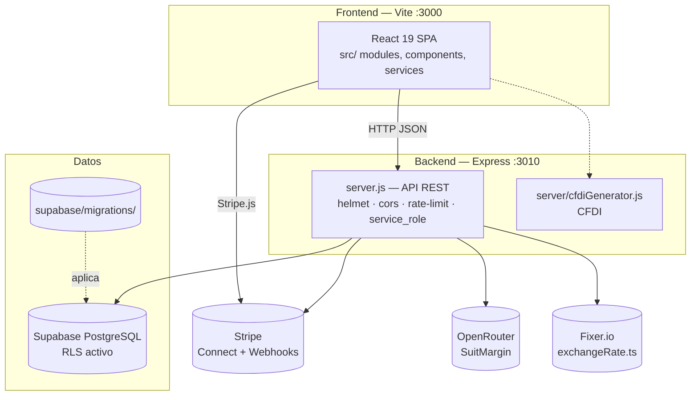

# 06 — Diagramas C4 · SuitServiHogar

> **Para qué sirve este documento:** diagramas C4 (contexto y contenedores) en Mermaid del sistema actual. C3/C4 solo si un contenedor crítico lo amerita.
> **Última revisión:** 2026-09-26 · **Generado por:** skill `auditoria` (piloto)
> **Leyenda de evidencia:** sólido = `VERIFICADO` · punteado = `PROBABLE` · omitido = `DESCONOCIDO` (registrar en pendientes)

## C1 — Contexto

```mermaid
flowchart LR
    cliente([Cliente — quien solicita<br/>reserva y paga]) -->|HTTPS| SH[SuitServiHogar]
    tecnico([Técnico/Aliado — quien presta<br/>el servicio]) -->|HTTPS| SH
    admin([Administrador<br/>del negocio]) -->|HTTPS| SH

    SH -->|pagos, escrow, webhooks| Stripe[(Stripe Connect)]
    SH -->|datos, RLS| Supabase[(Supabase PostgreSQL)]
    SH -->|tipo de cambio| Fixer[(Fixer.io API)]
    SH -->|IA precios (SuitMargin)| OpenRouter[(OpenRouter)]
    SH -.sin uso detectado.| Gemini[(Gemini @google/genai)]
    SH -->|CFDI / facturación| SAT[Servicio facturación<br/>PROBABLE]
```

- **Datos principales que entran/salen:** reservaciones, pagos en escrow, evidencia fotográfica, reseñas, mensajes, CFDI.
- Sistema externo omitido por falta de evidencia: ninguno conocido además de los listados.

## C2 — Contenedores



| Contenedor | Responsabilidad | Comunicación |
|---|---|---|
| React SPA (3000) | UI cliente/técnico/admin, formularios, paneles | HTTP JSON → API 3010 |
| Express API (3010) | Reglas de negocio, escrow, auth, validación | HTTPS, webhooks Stripe |
| Supabase | Persistencia + RLS + realtime (chat) | SDK supabase-js |
| CI `ci.yml` | lint → typecheck → unit → e2e → deploy | GitHub Actions |

## C3 — Componentes

No generado: pendiente de que un contenedor se modifique o se solicite (regla de la skill: C3 solo donde aporta valor).

## Pendientes (`DESCONOCIDO`)

- [ ] Proveedor real de facturación CFDI (¿¿servicio externo o librería local?)
- [ ] ¿`migrations/` raíz se aplica en algún pipeline o es legado?
